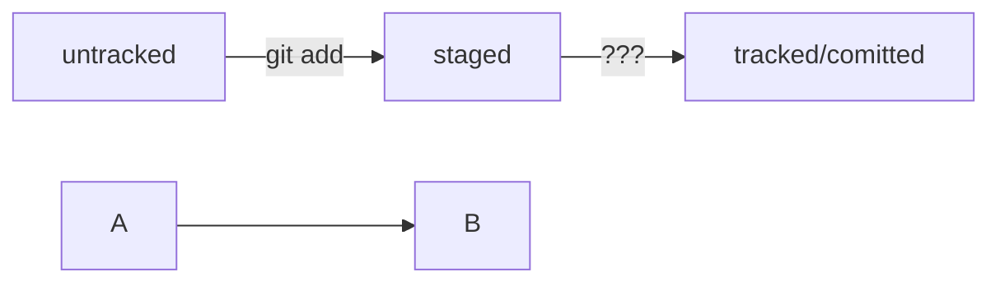

# Основы Git

## Основные команды Git

- `git init` — инициализация репозитория.
- `git add <file>` — добавление файла в индекс.
- `git commit -m "сообщение"` — создание коммита.
- `git status` — просмотр состояния репозитория.
- `git log` — просмотр истории коммитов.
- `git branch` — управление ветками.
- `git checkout <branch>` — переключение на ветку.
- `git push` — отправка изменений на удалённый репозиторий.
- `git pull` — получение изменений из удалённого репозитория.

## Инициализация проекта

1. Создайте папку для проекта.
2. Перейдите в папку и выполните `git init`.
3. Создайте файлы и добавьте их в индекс с помощью `git add`.
4. Сделайте первый коммит: `git commit -m "Initial commit"`.

## Регистрация на GitHub

1. Перейдите на [GitHub](https://github.com).
2. Зарегистрируйтесь, если у вас ещё нет аккаунта.
3. Создайте новый репозиторий на GitHub.
4. Следуйте инструкциям на GitHub, чтобы связать локальный репозиторий с удалённым.

----
mkdir my-git-repo
cd my-git-repo

git init

touch README.md
-
git remote add origin <URL-вашего-репозитория>
-
git add .
git commit -m "Initial commit"
git push -u origin main


----
## Выделение текста

Вы можете выделять текст в markdown с помощью символов `_` или `*`. Например:

Пример _курсива_ и **жирного** текста.

## Заголовки

Заголовки можно создавать с помощью символа `#`. Чем больше `#`, тем меньше заголовок. Например:

# Заголовок первого уровня
## Заголовок второго уровня
### Заголовок третьего уровня

## Выделение кода

Чтобы выделить текст как код, поместите его в тройные кавычки --//. 

```
mkdir my_project
cd my_project
git init
```

----
##Синхронизация локального и удалённого репозиториев
git remote add origin https://github.com/YandexPracticum/first-project.git (от англ. remote, «удалённый» + add, «добавить») — привяжи локальный репозиторий к удалённому с URL https://github.com/YandexPracticum/first-project.git;
git remote -v (от англ. verbose, «подробный») — проверь, что репозитории действительно связались;
git push -u origin main (от англ. push, «толкать») — в первый раз загрузи все коммиты из локального репозитория в удалённый с названием origin.
git push (от англ. push, «толкать») — загрузи коммиты в удалённый репозиторий после того, как он был привязан с помощью флага -u.

##Копирование чужих репозиториев
Клонирование
git clone git@github.com:TheGreatOwner/the-great-project.git (от англ. clone, «клон», «копия») — склонируй репозиторий с URL the-great-project.git из аккаунта TheGreatOwner на мой локальный компьютер.




